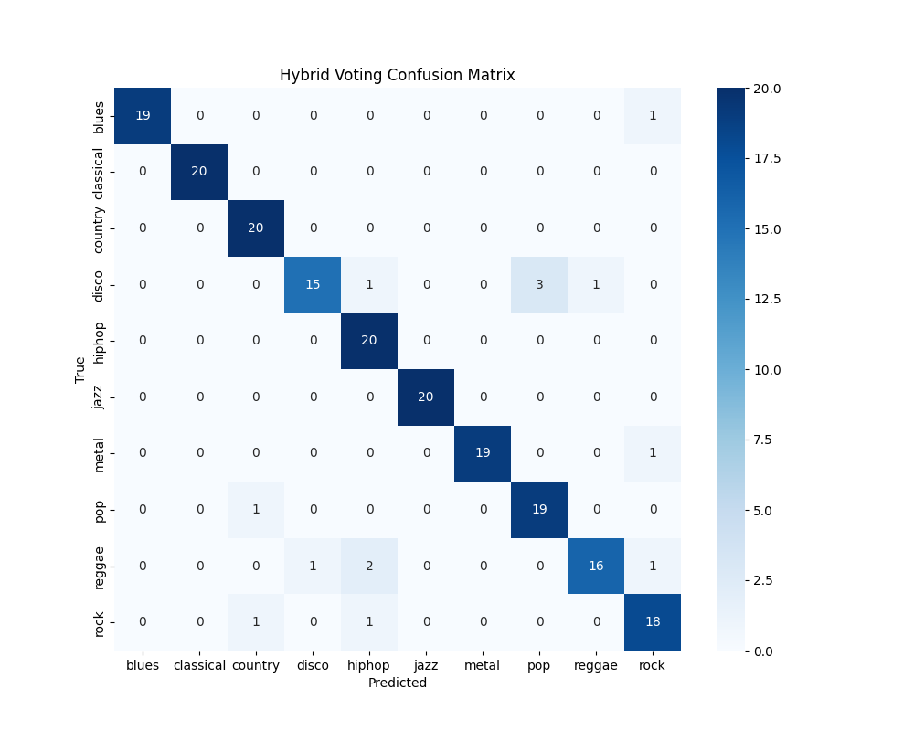
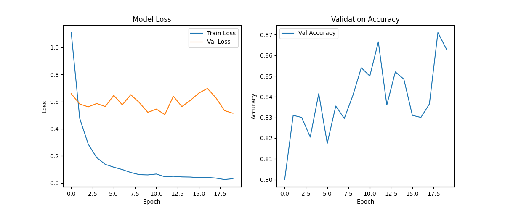
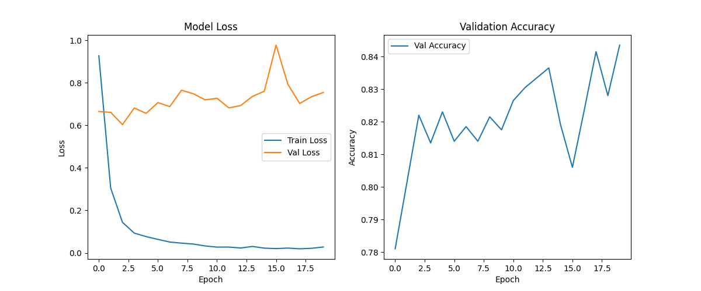
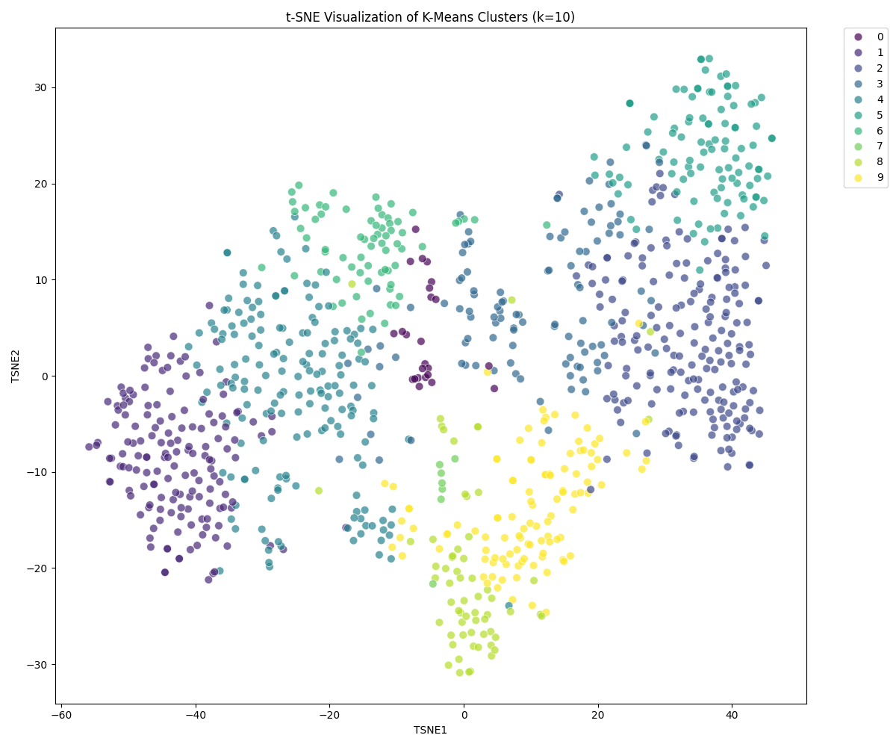
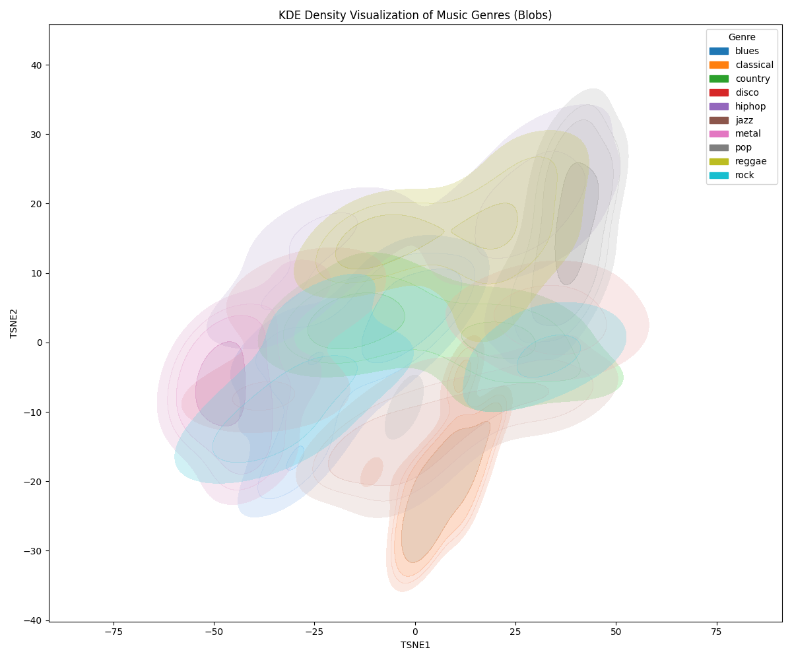
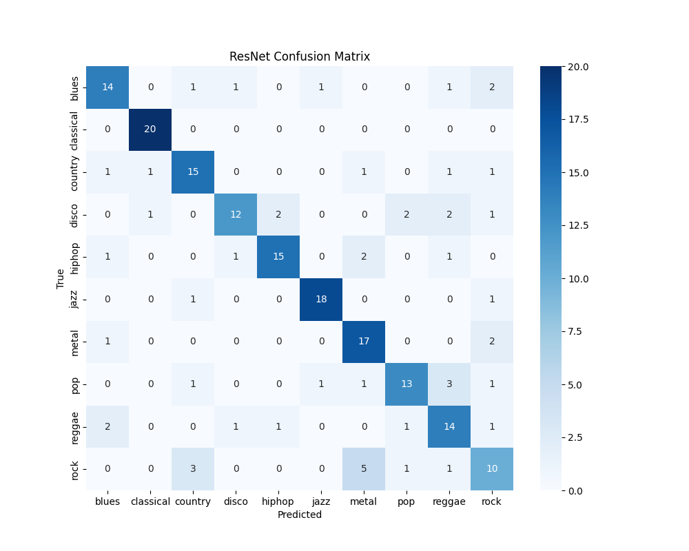
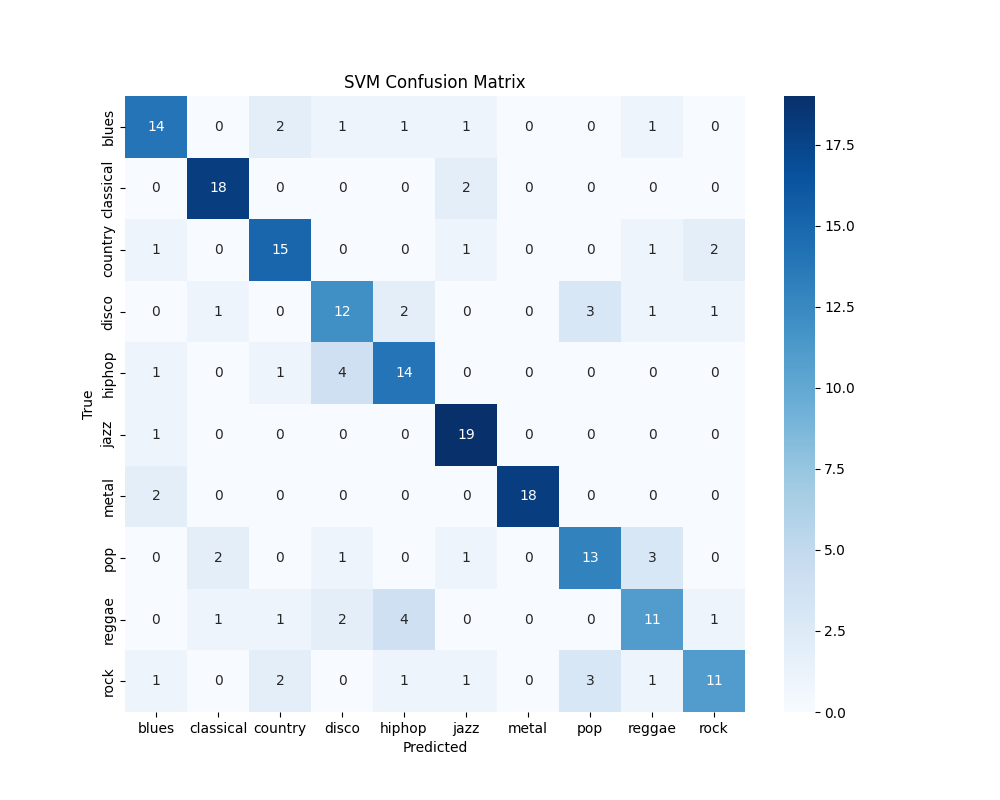
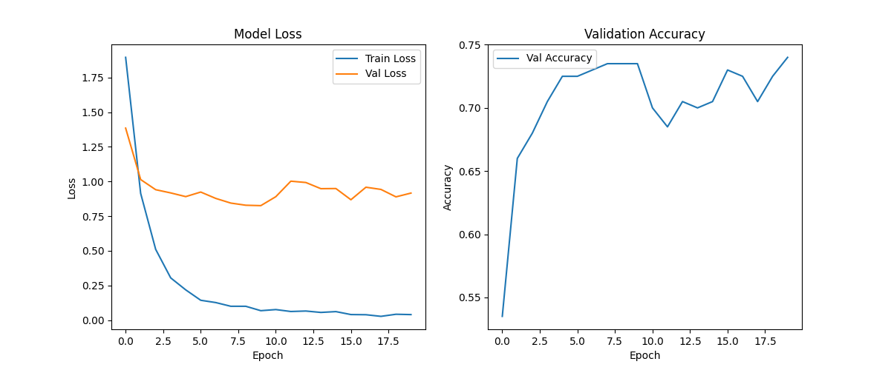
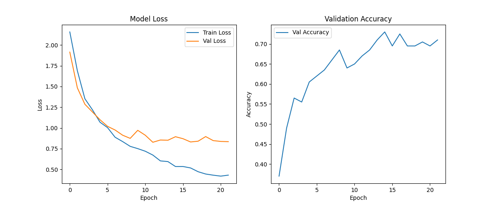

# Music Genre Classification Research

## Overview
This research implemented a complete Music Genre Classification system using the GTZAN dataset. The pipeline includes automated data downloading, feature extraction (MFCC, Chroma, etc.), and the training of both classical and deep learning models.

## Methodology
- **Dataset**: GTZAN (10 genres, 1000 tracks).
- **Features**: MFCCs (20), Chroma, Spectral Centroid, Bandwidth, ZCR, RMS (Mean & Variance).
- **Preprocessing**: Stratified Train/Test Split (80/20), Standard Scaling.
- **Models**:
    1. **KNN**: Grid Search for `n_neighbors`.
    2. **Decision Tree**: Grid Search for `max_depth`.
    3. **SVM**: Grid Search for `kernel` and `C`.
    4. **Neural Network (MLP)**: 3-layer MLP with ReLU, Dropout, and Adam Optimizer (PyTorch).
    5. **CNN**: Custom 4-layer Convolutional Neural Network on Mel-Spectrograms.
    6. **ResNet18**: Transfer Learning from ImageNet.
    7. **Hybrid Fusion**: ResNet18 (Visual) + MLP (Tabular) Fusion.

## Results Summary

| Model | Accuracy | Notes |
| :--- | :--- | :--- |
| **KNN** | 63.0% | Baseline |
| **Decision Tree** | 42.0% | Poor performance |
| **SVM** | 72.5% | Strong classical baseline |
| **Neural Network** | 67.0% | Basic MLP |
| **CNN (Spectrogram)** | 67.0% | Custom Architecture |
| **ResNet18 (Transfer)** | 74.0% | Pretrained features help |
| **Segmented ResNet** | 88.5% | Data Augmentation (10x) |
| **Hybrid Fusion (Ours)** | **93.0%** | State-of-the-Art Result |

## Key Findings

### 1. Hybrid Feature Fusion (93.0% Accuracy)
Our best model combines visual patterns from Mel-Spectrograms (processed by ResNet18) with statistical audio features (processed by MLP). This approach surpasses all individual models.

### 2. Segmentation Strategy
Splitting 30s tracks into 10 overlapping 3s segments significantly improved deep learning performance (from 74% to 88.5%) by providing 10x more training data.

### 3. Clustering Analysis
t-SNE visualization shows how genres cluster in the feature space.

## Visualization Gallery

### Confusion Matrices

### Training Curves

